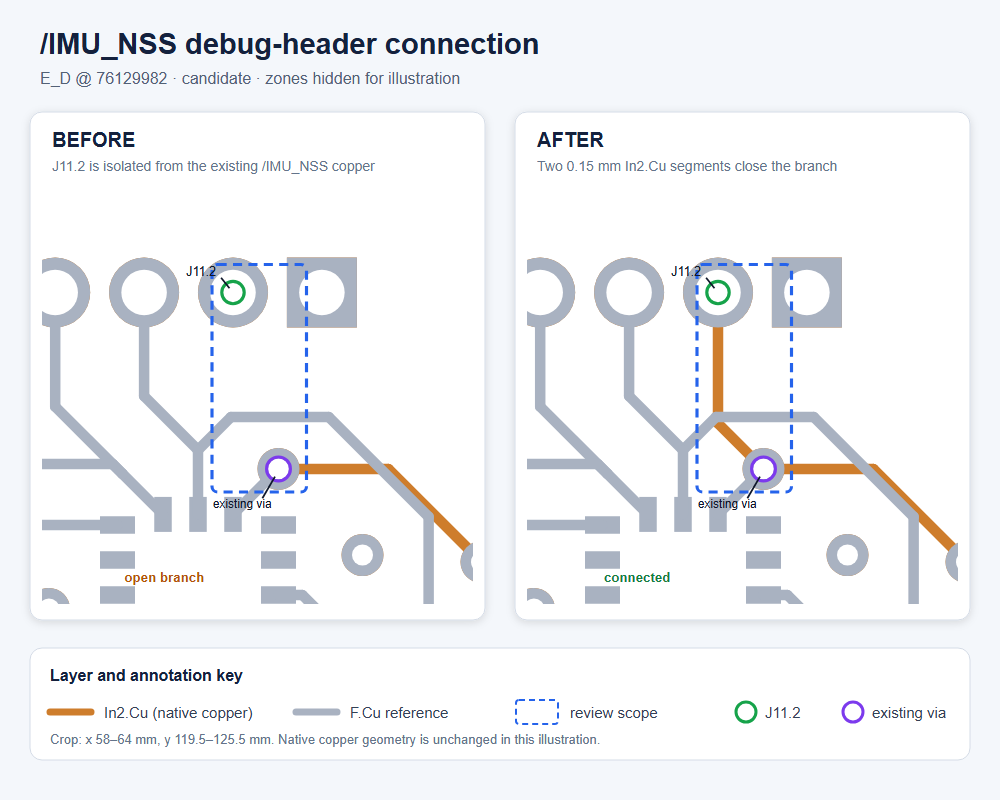

# `/IMU_NSS` SPI debug-header routing candidate

**Status:** AI-assisted proposal for target branch `E_D` at commit `76129982d0e0881cb25ae0796b046e084fccce70`, pending team review. No hardware test has been performed.

The boxed, zones-hidden view follows Ryan's August 4 request to mark the changed area so a reviewer can locate and copy a useful routing change against the target branch. It is derived from native KiCad copper-layer SVG exports: `In2.Cu` remains orange and `F.Cu` is muted gray for context. The crop is **x = 58–64 mm, y = 119.5–125.5 mm**. DRC was run on the complete design with its zones, not on this illustration.

## Scope

This candidate connects SPI Debug header pad `J11.2` to the existing `/IMU_NSS` copper at the via centered at `(61.30, 123.57) mm`.

- Added two `In2.Cu` segments: `(61.30, 123.57) → (60.65, 122.92) → (60.65, 121.05) mm`.
- Width: `0.15 mm`; total added length: approximately `2.789 mm`; new vias: `0`.
- The destination is `J11.2` at `(60.65, 121.05) mm`.
- Existing design bytes were retained; the candidate adds only the two segment objects.

The main MCU-to-IMU chip-select path was already routed between `U5.89 / PD7` and `U4.12 / LSM6DSV CS`. This candidate only adds the previously isolated debug-header branch. It does **not** repair or redesign the MCU-to-IMU path.

## Validation

| Check | E_D baseline | Candidate | Result |
|---|---:|---:|---|
| DRC rule-violation entries | 331 | 331 | 0 new entries |
| Unconnected items | 29 | 28 | `/IMU_NSS` debug-header branch resolved |
| Schematic parity issues | 0 | 0 | unchanged |

The strict comparison found the full 331-entry rule-violation list unchanged. In the raw unconnected-item diff, KiCad replaced `J39.3` with a short-track endpoint as the representative for the same unchanged `5V` copper island; that endpoint is exactly at the pad center in both boards. Treating those as aliases leaves zero new island pairs and one resolved pair: the intended `/IMU_NSS` branch.

The whole board still has existing DRC findings and has not passed board-level validation. No hardware, signal-integrity, firmware, or IMU functional test was performed, so this result does not show that the IMU is operational.

## Short review path

1. In the figure, confirm that the **before** view stops at the existing via and the **after** view reaches `J11.2` inside the blue scope box.
2. Compare the candidate PCB with `E_D` at the commit above: the intended delta is exactly two `0.15 mm` `In2.Cu` segments and no via or rule change. The compact machine record is in [`route_operations.json`](route_operations.json).
3. Confirm the full-design DRC comparison shown in the table. [`validation_summary.json`](validation_summary.json) contains the compact strict comparison and the verified `5V` representative change; the complete reports are available only if a specific finding needs inspection.
