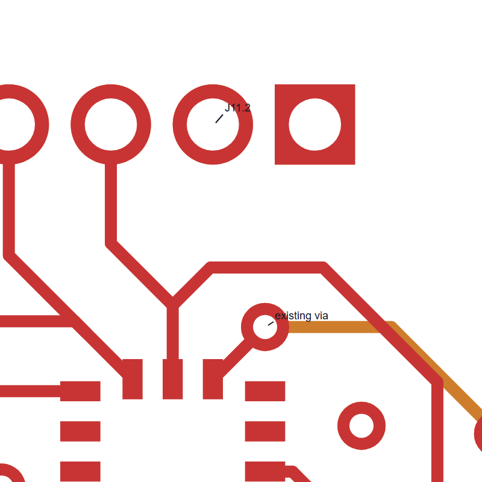
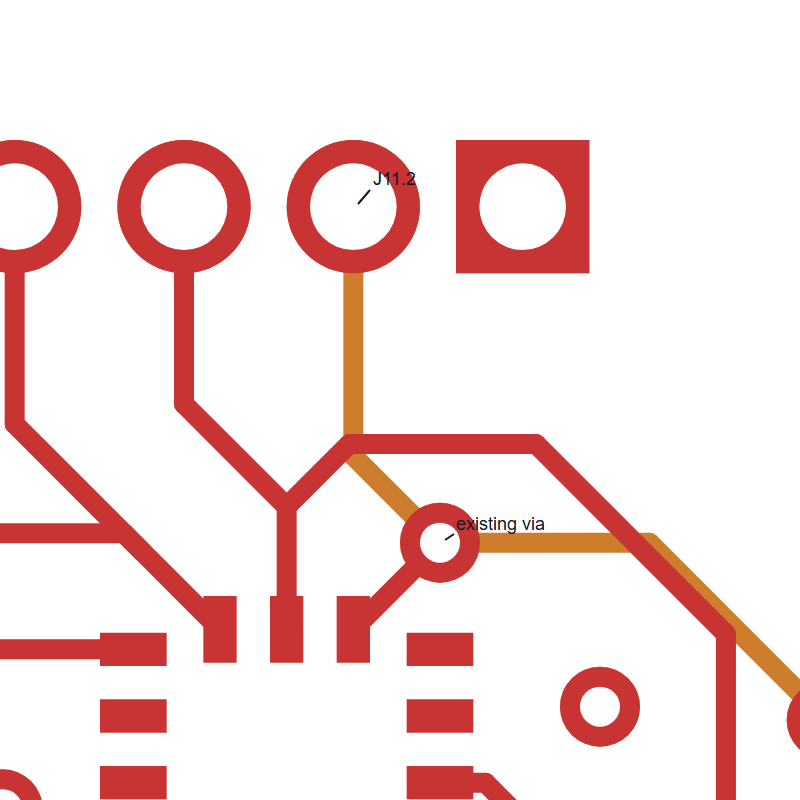

# J11.2 SPI debug connection

This change is based on `E_D` at `7612998`.

J11.2 was missing its connection to `/IMU_NSS`. The STM32 and IMU were already connected. This change brings the same signal out to the debug header.

I added two 0.15 mm tracks on `In2.Cu`. They run from the existing via at (61.30, 123.57), through (60.65, 122.92), to J11.2 at (60.65, 121.05). All coordinates are in mm. The added length is 2.789 mm.

The inner layer avoids the SPI clock trace on the front layer. No new vias were needed. The schematic, project rules, and existing PCB objects were left as they were.

I used KiCad 10.0.6 for the checks. Zone refill, all track errors, all severities, and schematic parity were enabled.

- Unconnected reports: 29 to 28. The J11.2 connection is now complete.
- Rule violations: 331 to 331. No entries were added or changed.
- Schematic parity issues: 0 before and after.

One remaining 5V airwire points to a different object in the new report. The old and new objects are on the same copper island. I checked that the short track ends at J39.3 in both versions.

This was prepared with AI assistance. It has not been tested on hardware. The other board issues still need work.

[Route coordinates](route_operations.json) · [Check results](validation_summary.json)

Before

After

Copper zones are hidden in these views. The checks used the full board.
